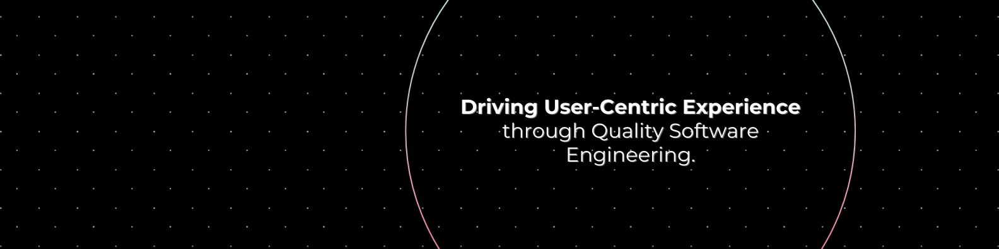
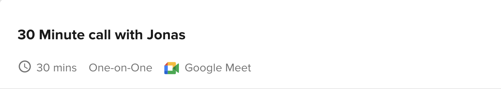

<h1 align="center"> Hello! 👋, I'm Jonas</h1>

## 🛠️ **`(Backend Developer | QA Engineer)`**

🌍 𝖬𝖾: 
As a seasoned QA Engineer and Backend Developer with over 5 years of experience. I'm commited to delivering exceptional user satisfaction by paying meticulous attention to detail in software engineering. 

⛳️ 𝖫𝖾𝖺𝗋𝗇𝗂𝗇𝗀(𝗌): 𝙴𝚏𝚏𝚎𝚌𝚝𝚒𝚟𝚎 𝚙𝚛𝚘𝚋𝚕𝚎𝚖-𝚜𝚘𝚕𝚟𝚒𝚗𝚐 𝚛𝚎𝚚𝚞𝚒𝚛𝚎𝚜 𝚎𝚖𝚋𝚛𝚊𝚌𝚒𝚗𝚐 𝚍𝚒𝚟𝚎𝚛𝚜𝚎 𝚙𝚎𝚛𝚜𝚙𝚎𝚌𝚝𝚒𝚟𝚎. 
I have committed myself to continuous growth by prioritizing teamwork and cultivating traits such as accountability, continuous learning, autonomy, flexibility, and communication, with my primary goal of ensuring user satisfaction by delivering quality products.

🎯 𝖦𝗈𝗂𝗇𝗀 𝖥𝗈𝗋𝗐𝖺𝗋𝖽:  
I am excited about leveraging my extensive experience to contribute to innovations that push technological boundaries.

Let's collaborate and create something extraordinary!
  

## 🔧 Skills | Technologies | Tools
Python | Django | Django-rest-framework | JavaScript | HTML5 | CSS3 | SQL | Cypress | Postman | Superset | Katalon Studio | Docker | Git | Github Actions | Slack | Twists | Threads | Asana | Trello | ClickUp | Jira | Agile | Scrum | Waterfall
  

## 💻 Projects

<!-- Start Project Cards -->

Stay tuned, something exciting is coming soon!

<!-- End Project Cards -->

  

## 📫 Interested in meeting Jonas?

#### For Collaboration or Discussing Opportunities 🤝
Let's schedule a chat! Click below to check my availability and set up a meeting.
*Please make sure to include a brief description of the agenda so we can make the most of our time together.*

#### Let's Connect 😎
I'm always open to connecting with like-minded professionals!
Feel free to reach out via:

  
 
## 🏄‍♂️ Hobbies
Surfing | Swimming | sports | Travel | Football Manager.
 
##

 <i><a href="https://github.com/thejonasjon/" style="text-decoration: none; color: inherit;">Made with ❤️ by Jonas</a></i>

