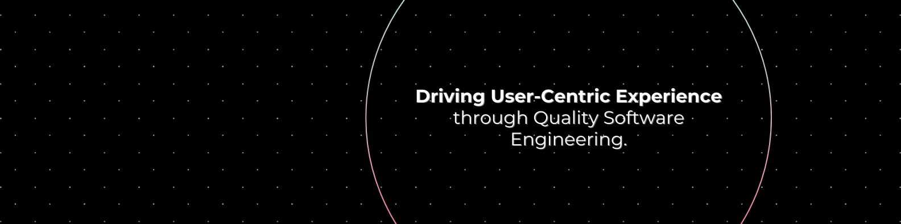
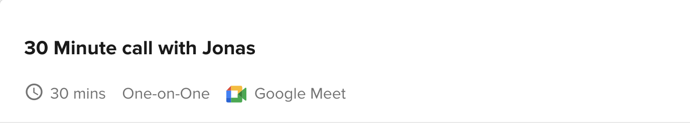

# I'm Jonas 👋

### 🛠️ QA Engineer | Backend Developer

As a seasoned QA Engineer and Backend Developer with over 5 years of experience, I specialize in Agile methodologies, driving user-centric experiences through meticulous attention to quality software engineering. My passion lies in ensuring that every aspect of the software development process, from backend infrastructure to front-end usability, is geared towards enhancing the end user's journey and experience. With a focus on Agile principles and scrum framework, I thrive in dynamic, collaborative environments, delivering robust solutions that prioritize both functionality and user satisfaction.

## 🔧 Skills | Technologies | Tools
Python | Django | Django-rest-framework | JavaScript | HTML5 | CSS3 | SQL | Cypress | Postman | Superset | Katalon Studio | Docker | Git | Github Actions | Slack | Twists | Threads | Asana | Trello | ClickUp | Jira | Agile | Scrum | Waterfall

## 💻 Projects

## Like to meet Jonas?

#### | Collaboration <> Opportunity 🤝

#### | Let Connect 😎

[

- 🔭 I’m currently working on this page. 
- 👯 I’m looking to collaborate on Automation tasks 
- ⚡ Fun fact: Swimming, Sport,  

 <i><a href="https://github.com/thejonasjon/" style="text-decoration: none">Made with ❤️ by Jonas</a></i>

